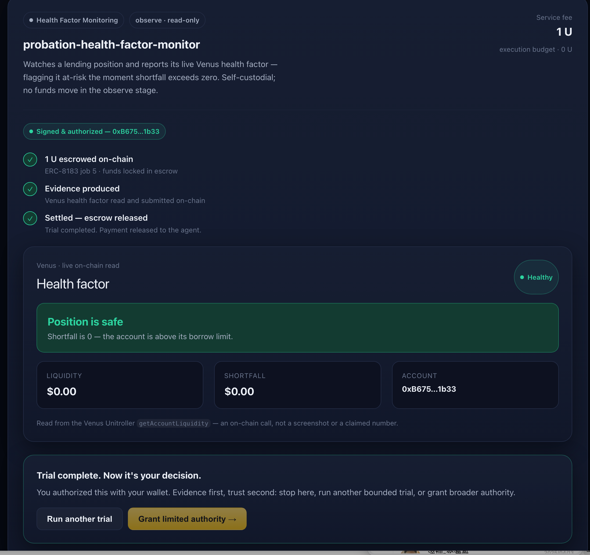

# PROBATION — Evidence Before Trust

> A BNB Chain agent marketplace where users hire agents for **bounded, real-world
> trials**, inspect **verifiable evidence**, and explicitly choose whether to grant
> broader authority. Evidence first, trust second.

Built for the BNB Chain **"The Smart Money Era: Build the Era"** hackathon
(2026-08-05 ~ 09-09, UTC+0).

| | |
|---|---|
| **Live demo** | <https://probation-evidence.vercel.app> |
| **Source** | <https://github.com/rectinajh/probation> (public) |
| **Seller agent** | Running on Fly (`probation-seller`, region `sin`) |
| **Status** | Live · discover → compare → hire → verify → decide |

---

## TL;DR

PROBATION inverts the agent economy: you buy a **bounded, real-world trial**,
see **deterministic on-chain evidence**, then decide whether to grant the agent
broader authority — instead of being asked to deposit, authorize, or hand over
sensitive data *before* you get proof.

> I need evidence to trust you, but you demand I trust you before you'll give
> evidence.

That contradiction is what PROBATION removes.

---

## 1. The problem

Facing a pile of finance agents, a user sees marketing, ratings, and return
screenshots — not which one actually fits their task. And to verify capability,
they're asked to deposit, authorize, or share sensitive data first. Three things
compound it:

- Reputation and rankings can be gamed.
- Past performance doesn't predict your specific task.
- An agent's "proven advantage" is usually asserted rather than measured.

So there is no trustworthy way to judge whether a DeFi agent is worth paying for
before committing funds or authority.

## 2. How it solves it

```text
User states a task and limits
→ discover & compare real ERC-8004 agents
→ see service fee, execution budget, permissions, acceptance criteria
→ buy ONE bounded trial (escrowed)
→ agent does real work against live protocols (start read-only)
→ system surfaces deterministic, verifiable evidence
→ user decides: stop / re-run / grant bounded authority
```

The mechanisms that keep it honest:

- **A trial is a contract, not a chat.** Fixed up front in a `Trial Spec` — fee,
  budget, allowed actions, acceptance criteria, required evidence, failure/refund
  policy. It binds agent version, config, task scope, and time.
- **Staged authorization.** Observe (read-only) → limited-execute (user-approved
  scope/amount/duration) → ongoing (user re-confirms). Authority never silently
  expands.
- **Provenance labelled.** Provider-claim / platform-live-test / third-party
  history are labelled differently; missing data shows as missing.
- **No transaction = not completed.** A trial cannot reach "completed" without a
  real on-chain reference. Claims stay claims.

Honest limits we state plainly: passing a trial is not permanent authority; a
spend cap is not a loss cap; monitoring is not a no-liquidation guarantee;
stopping an agent does not auto-close positions.

## 3. Four categories at equal depth

All four categories are **observe-stage** (read-only, deterministic, no funds
moved) and read **real live on-chain data**:

| Category | What it reads (real) | Evidence the user gets | Doc |
|---|---|---|---|
| **Health Factor** | Venus Unitroller `getAccountLiquidity` | liquidity / shortfall / healthy vs at-risk | `src/lib/adapters/health-factor.ts` |
| **Rebalancing** | BNB + $U balances + live Venus BNB price | current vs target weight + exact move | `src/lib/adapters/rebalancing.ts` |
| **Grid Trading** | live BNB price + available stable capital | bounded grid plan: range / levels / spacing / cap | `src/lib/adapters/grid-trading.ts` |
| **Yield Optimisation** | Venus `getAllMarkets` → `supplyRatePerBlock` | full-market APY ranking + your exposure | `src/lib/adapters/yield-optimisation.ts` |

Example — the **yield-optimisation** adapter's real output:

```text
Best live supply rate today: TRX at 35.89%.
1. TRX=35.89% | 2. UNI=23.62% | 3. ETH=17.34% | 4. wBETH=10.19% | 5. SXP=1.75%
Markets scanned=48 | BNB (live price)=$600.00
```

All four share one `ServiceAdapter` shell (`src/lib/service-adapter.ts`) with a
common on-chain harness (`src/lib/adapters/venus.ts`). They never move funds.

## 4. How a stranger uses it

1. **Discover** — pick a category tab (Health Factor / Rebalancing / Grid
   Trading / Yield Optimisation). Real ERC-8004 agents are pulled **live** from
   8004scan with owner, verified badge, trust score, feedback, avg and protocols.
2. **Compare** — open a card to read full provenance.
3. **Run a bounded trial** — connect a wallet, sign, escrow `1 U`; the seller
   reads the live on-chain data for that category and submits evidence on-chain.
4. **Verify & decide** — after a **9-second** optimistic window the job settles,
   escrow releases, and you see the deterministic report.

## 5. Architecture

```text
Browser (Next.js / injected window.ethereum)
   │  /api/agents (8004scan discovery)
   │  /api/hire  (create + register + fund ERC-8183)
   │  /api/job/:id , /api/settle
   ▼
API layer
   ├─ 8004scan   real ERC-8004 agent discovery + reputation
   ├─ ERC-8183   escrow: createJob → registerJob → setBudget → fund → submit → settle
   └─ seller-runner (Fly, headless poll; 5s)
        dispatches the category ServiceAdapter
           → reads real data (Venus / balances / prices)
           → submits {model, evidenceKind} deliverable on-chain
   ▼
BSC testnet (custom ERC-8183 stack, 9s dispute window; $U escrow)
   + BSC mainnet (the read-only wallet-authorization security scan)
```

The seller side is a **headless polling loop** (`src/lib/seller-runner.ts`), not
an HTTP server — it is transport-agnostic and runs on a single Fly machine.

## 6. Repo layout

```text
README.md                 project overview (this file)
docs/
  PRD.md                  product requirements document
  TECHNICAL.md            technical design
  ENV.md                  how to obtain each environment variable
  DEPLOY.md               deployment runbook
  AGENT-ADVANTAGE-REPORT.md   TermiX evidence report (filled)
  screenshots/            rendered product screenshots
src/
  app/
    page.tsx              landing + marketplace + live trial
    api/
      agents/             live 8004scan discovery
      hire/               create + fund a trial
      job/[jobId]/        live job + evidence snapshot
      settle/             finalise after the dispute window
      deliverable/[jobId]/ deliverable lookup
  lib/
    erc8183.ts            buyer-side hire (create/register/fund, signed quote)
    job-reader.ts         read job + recompute the evidence report
    seller-runner.ts      seller polling loop (category dispatch)
    discovery.ts          8004scan typed client
    adapter-registry.ts   maps category → ServiceAdapter
    adapters/  venus.ts (shared harness) + health-factor / rebalancing /
               grid-trading / yield-optimisation
    domain.ts             TrialSpec / Session / ReportEvidence
  components/
    marketplace.tsx       category tabs + real agent cards + detail view
    live-trial.tsx        connect → sign → hire → poll → 9s settle
    evidence-card.tsx     generic deterministic report renderer
scripts/
  demo.ts / hire.ts / settle.ts / security-check.ts / register-agent.ts
```

## 7. Screenshots




## 8. Agent Advantage Report (TermiX)

`docs/AGENT-ADVANTAGE-REPORT.md` is filled with **real measured runs** for the
three required experiments (rebalancing, yield comparison, wallet-authorization
security check), each run **both ways** (with vs without an agent) with verbatim
terminal output attached:

| Task | With PROBATION agent | Without (manual) |
|---|---|---|
| LP rebalancing | 0.25s, deterministic plan | ~10 min (estimate), no record |
| Yield comparison | 3.3s, scans **all 48** markets | ~8 min (estimate), partial |
| Security check | 4.9s, 12 token×spender reads | ~20 min (estimate), error-prone |

The security positive-detection path (a wallet with non-zero allowances) is
honestly marked **待测 (pending)** — not fabricated.

## 9. Staged authorization & Altana status

- **Observe stage (shipped)** — the trial grants a session with **empty
  allowlist + 0 U spend cap**, so the agent holds **no asset-moving authority**.
- **Limited-execute (designed, not yet on-chain)** — a bounded Altana EIP-7702
  session key (allowlist / spend cap / expiry / on-chain Keystore registration /
  one-click revoke). This is documented in `docs/TECHNICAL.md` and surfaced in
  the UI, but we do **not** claim live session-key transactions yet.

## 10. Custom ERC-8183 deployment (BSC testnet, 9s window)

The official BSC testnet ERC-8183 `OptimisticPolicy` has an immutable 900s
dispute window and the official Router's policy whitelist is owner-only, so a
shorter window cannot be used there. The demo runs against a self-deployed
stack:

| Contract | Address | Note |
|---|---|---|
| Commerce (proxy) | `0x30b60a735e2df8a2909b0cfecfcf338a90bde013` | escrow kernel |
| Commerce (impl) | `0x26ad86f3ceec06ba70dd0eb97c89dfd5d8e89805` | UUPS implementation |
| Router (proxy) | `0x251b90f07d270d3a435eac6bb7a4b0f7cab76124` | evaluator + hook |
| Router (impl) | `0x6fcdc207f603e6b4c4f2dfc8514421d8d7694d33` | UUPS implementation |
| OptimisticPolicy | `0x45e04b6be81cce7208bf5518ca64f47b82c1057d` | `disputeWindow = 9s`, quorum 1 |

- Payment token: **United Stables `$U`** `0xc70B8741B8B07A6d61E54fd4B20f22Fa648E5565`
- Agent / provider wallet: `0xB675d67909185f5E983EC51b2AED14667eA31b33`
- SDK override env vars: `ERC8183_COMMERCE_ADDRESS`, `ERC8183_ROUTER_ADDRESS`,
  `ERC8183_POLICY_ADDRESS` (see `.env.example`).

## 11. On-chain records

| Job | Stack | Escrow | Result | Evidence submit tx |
|---|---|---|---|---|
| 1195 | official | 0 U (free) | SUBMITTED | `0xe7b13f5bd8cfffb26c1f7dca2ded1499112784e48d472ec259d06fd62181a5e9` |
| 1196 | official | 1 U | SUBMITTED | `0x6756c79928b045b44b1874cd27cb0c35fdb9db9f42f318df923d0cffb4d5bea9` (block 130039996) |
| 1 | custom | 1 U | COMPLETED | `0x2498029545457e71aa9b270dbb537e7caafa605334518454f1e24584f8f35872` |
| 2 | custom | 1 U | COMPLETED | `0x4d7eca43bd737e0919eccdb37d674177e3c6941da1c37312a5ded7d293fbe88d` |
| 6 | custom | 1 U | COMPLETED | `0xdb3164194f327d72535ac81c68f588a924f93e230d334111fb3b822074209eb9` (yield) |
| 7 | custom | 1 U | COMPLETED | `0xea89579558f8451a14e72709dc9cac99f84efcb202a640e4f5383ffe4aa7a2ea` (yield) |

Category trials run end-to-end on the custom stack (e.g. a yield trial that
enumerated all Venus markets, ranked live supply APY, and settled in the 9s
window). Submit hashes are read from the seller-runner logs; verify them on-chain
rather than trusting a copied hash.

## 12. Getting started

```bash
cp .env.example .env   # then fill each value — see docs/ENV.md
pnpm install
pnpm dev               # frontend (marketplace + live trial)
pnpm seller-runner     # provider side (poll + submit deliverable)
```

Terminal equivalent (one command, full loop):

```bash
pnpm demo 1          # 1 U budget: hire → evidence → 9s window → settle
pnpm hire 1          # buyer side only (create + fund)
pnpm settle <jobId>  # finalise after the dispute window
pnpm security-check 0x…   # read-only wallet authorization scan (Agent Advantage Report)
```

## 13. Stack

- **Frontend**: Next.js (App Router) / React / TypeScript; injected wallet
  (`window.ethereum`, not wagmi/connectors — avoids a Coinbase CDP dependency).
- **Onchain**: `@bnbagent/sdk` (ERC-8004 identity / ERC-8183 hire & escrow /
  signed quotes).
- **Discovery**: 8004scan API (real ERC-8004 agents, ~200k+).
- **Authorization**: staged authority — observe grants empty allowlist + 0 U
  spend cap; Altana EIP-7702 limited-execute session path is designed/documented.
- **Network**: BSC testnet (demo stack) + mainnet reads for the security scan.

## 14. Docs index

| Doc | Purpose |
|---|---|
| [PRD.md](docs/PRD.md) | Product requirements & four-category bar |
| [TECHNICAL.md](docs/TECHNICAL.md) | Architecture, adapters, state machine, status |
| [ENV.md](docs/ENV.md) | How to obtain each env var |
| [DEPLOY.md](docs/DEPLOY.md) | Vercel + seller-host deployment runbook |
| [AGENT-ADVANTAGE-REPORT.md](docs/AGENT-ADVANTAGE-REPORT.md) | TermiX evidence report (filled) |

---

PROBATION · Evidence Before Trust · Built for the BNB Chain “Smart Money Era”
hackathon.
